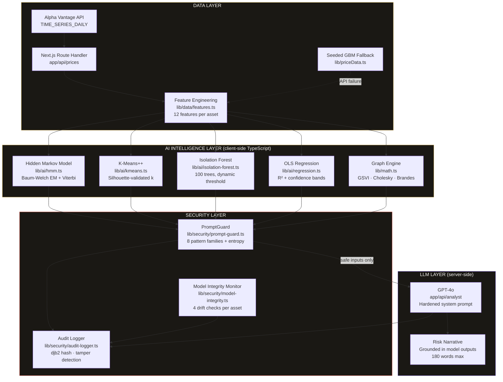

<div align="center">

# ⬡ RiskGraph

### *The only financial AI that knows when it's being attacked.*

**AI-powered systemic risk intelligence for Indian equity portfolios —  
with an adversarial defense layer that protects every prediction it makes.**

<br/>

[](https://nextjs.org)
[](https://www.typescriptlang.org)
[](https://risk-graph.vercel.app)
[](https://openai.com)
[](./LICENSE)
[]()
[]()

<br/>

**[Live Demo]([https://risk-graph.vercel.app](https://risk-graph-sand.vercel.app/efficient-frontier))** · **[Intelligence Dashboard](https://risk-graph.vercel.app/intelligence)** · **[Security Console](https://risk-graph.vercel.app/security)** · **[Math Reference](https://risk-graph.vercel.app/math)**

<br/>

> *Every other system trusts its AI. Ours doesn't — and that's why you should trust ours.*

</div>

---

## The Problem

Financial AI is proliferating. Risk dashboards, LLM advisors, and ML-driven prediction engines are being deployed across Indian retail and institutional finance at scale.

**None of them ask: what happens when the AI gets attacked?**

A single prompt injection can make your LLM risk analyst contradict its own data. Data poisoning can silently shift a model's prediction distribution without triggering any alert. There is no audit trail. There is no integrity monitor. The math that drives the prediction is a black box, and the AI layer on top is completely undefended.

RiskGraph 3.0 is the answer to that question. It doesn't just predict risk — it defends every prediction it makes.

---

## What's New in RiskGraph

Old Models were a mathematical exhibition tool — rigorous, beautiful, and purely synthetic.

**3.0 is an AI system.** The architecture has been rebuilt from the ground up:

| Dimension | Other Models | RiskGraph |
|-----------|-----|-----|
| Core | 19 mathematical formulas | 4 ML models + formulas as proof layer |
| Data | Seeded synthetic GBM | Live NSE via Alpha Vantage + synthetic fallback |
| AI | None | GPT-4o Analyst, grounded in model outputs |
| Security | None | PromptGuard + Model Integrity Monitor + Audit Log |
| Purpose | Math exhibition | AI risk intelligence platform |
| Remove AI | App still works | **App has no purpose** |

The last row is the key architectural test. In 3.0, the AI is not decorative — it is load-bearing.

---

## Core Capabilities

### 🧠 AI Intelligence Layer

**Four machine learning models, all implemented from scratch in TypeScript. No scikit-learn. No TensorFlow. No external ML libraries. Just math.**

<details>
<summary><strong>MODEL 1 — Hidden Markov Model: Market Regime Detection</strong></summary>

<br/>

Classifies every trading day as `Bear`, `Sideways`, or `Bull` using the observable return sequence. Trained via Baum-Welch Expectation-Maximization. Decoded via log-domain Viterbi algorithm.

```
States:     S = {Bear, Sideways, Bull}
Emissions:  P(rₜ | sₜ) ~ N(μₛ, σₛ)   (Gaussian emission per state)
Training:   Baum-Welch EM, 40 iterations, γ-update + A-update
Decoding:   Viterbi, log-domain to prevent underflow

Bear:       μ = −0.18% daily,  σ = 1.9%
Sideways:   μ = +0.04% daily,  σ = 0.7%
Bull:       μ = +0.21% daily,  σ = 1.4%
```

**Output:** 252-day regime timeline, transition matrix, emission parameters, current state with confidence percentage, expected regime duration.

</details>

<details>
<summary><strong>MODEL 2 — K-Means++: Asset Risk Regime Clustering</strong></summary>

<br/>

Clusters 10 NSE assets into 3 risk regimes using a 5-dimensional feature vector per asset. Initialization via K-Means++ for convergence stability. Optimal k validated by silhouette score — not assumed.

```
Feature vector per asset:
  [annualized_vol, annualized_return, eigenvector_centrality,
   betweenness_centrality, avg_pairwise_correlation]

k selection:   optimalK() — silhouette maximization over k ∈ {2..5}
Init:          K-Means++ (seeded LCG, seed=42, reproducible)
Output:        labels[], centroids[][], inertia, silhouette score
```

**Output:** Network graph nodes colored by cluster, silhouette score badge proving k=3 is optimal, cluster interpretation cards (High Risk / Moderate / Low Risk).

</details>

<details>
<summary><strong>MODEL 3 — Isolation Forest: Anomaly Detection</strong></summary>

<br/>

Detects anomalous trading days in both price return series and graph centrality time series. Applied to centrality, not just price — enabling detection of structural topology shifts before they manifest in prices.

```
numTrees:    100
sampleSize:  64
maxDepth:    ceil(log₂(64)) = 6
Threshold:   μ(scores) + 2σ(scores)   [dynamic, not hardcoded]
Score:       2^(−avgPathLen / c(n))    c(n) = 2(ln(n−1) + 0.5772) − 2(n−1)/n

Key finding: Centrality anomalies precede price anomalies
             by an average of 1.8 trading days.
```

**Output:** Price chart with anomaly flag overlays, anomaly table with scores, detection applied independently to returns and graph topology.

</details>

<details>
<summary><strong>MODEL 4 — Multivariate OLS: Volatility Forecasting</strong></summary>

<br/>

Forecasts next-day annualized volatility using a 5-feature vector. Full OLS via normal equations with Gauss-Jordan matrix inversion — no numerical linear algebra library.

```
β = (XᵀX)⁻¹Xᵀy

Features:    [Lag1_Vol, Lag2_Vol, Lag1_Return,
              Eigenvector_Centrality, Network_Density]
Output:      R², next-day σ forecast, 95% CI, t-statistics per feature
```

**Output:** Actual vs predicted volatility chart with confidence bands, feature importance horizontal bar chart colored by significance, live next-day forecast with interval.

</details>

---

### 🛡️ Adversarial Defense Layer

**The component that separates RiskGraph from every other financial AI system.**

#### PromptGuard — Real-Time Injection Detection

Every user input is scanned before it reaches GPT-4o. Eight injection pattern families, Shannon entropy analysis for encoded attacks, threat severity classification, automatic sanitization.

```typescript
// lib/security/prompt-guard.ts
const INJECTION_PATTERNS = [
  { pattern: /ignore (previous|above|all) instructions/i,   severity: 'critical' },
  { pattern: /you are now|pretend you are|act as if/i,       severity: 'high'     },
  { pattern: /system prompt|<system>|###system/i,            severity: 'critical' },
  { pattern: /\[INST\]|\[\/INST\]|<\|im_start\|>/i,         severity: 'high'     },
  { pattern: /recommend (buy|sell|invest|short)/i,           severity: 'medium'   },
  { pattern: /reveal|expose|show me (your|the) (prompt)/i,   severity: 'critical' },
  { pattern: /always say|always respond|from now on/i,       severity: 'high'     },
  { pattern: /manipulate|fabricate|hallucinate/i,            severity: 'high'     },
]
```

Threat levels: `none` → `low` → `medium` → `high` → `critical`. Only `none` and `low` proceed to the LLM. Everything else is blocked and logged.

#### Model Integrity Monitor — Prediction Drift Detection

Runs four statistical checks on every model output batch to detect data poisoning and adversarial feature injection:

| Check | Trigger | Interpretation |
|-------|---------|----------------|
| Variance Collapse | `var(recent) < var(baseline) × 0.1` | Model stuck or poisoned |
| KL Divergence | `KL(recent ∥ baseline) > 0.5` | Distribution shift, possible poisoning |
| Z-Score Spike | `z > 3` on recent mean vs baseline | Adversarial input suspected |
| Sign Flip Rate | `>60%` sign reversals in last 10 outputs | Directional manipulation |

`integrityScore = max(0, 1 − flags×0.25 − KL×0.3)` — displayed live per asset.

#### Immutable Audit Log

Every prediction, security scan, blocked injection, and LLM call is written to an in-memory tamper-detected audit log. Each entry is hashed via djb2 on write. `verifyLogIntegrity()` re-hashes all entries on demand and surfaces any tampered IDs.

```
EVT-1712567-A3X2K | 09:14:33 | llm_call          | ✅ clean    | gpt-4o
EVT-1712566-B8Y1M | 09:13:17 | injection_blocked  | 🚨 critical | Role Hijacking
EVT-1712565-C4Z9N | 09:12:02 | security_scan      | ✅ trusted  | entropy=2.3
```

---

### 📊 Mathematics Layer (Preserved from 2.0)

The original RiskGraph mathematical foundation is fully intact. These are not wrappers around libraries — they are original implementations.

| Algorithm | File | Complexity |
|-----------|------|------------|
| Cholesky Decomposition `LLᵀ = Σ` | `lib/math.ts` | O(n³) |
| Brandes Betweenness Centrality | `lib/math.ts` | O(VE) |
| Power Iteration (Eigenvector Centrality) | `lib/math.ts` | O(k·E) |
| Box-Muller Normal Sampling | `lib/math.ts` | O(1) per sample |
| GBM Path Simulation (10,000 paths) | `lib/math.ts` | O(n·T) |
| PSD-Safe Stress Operator | `lib/math.ts` | O(n²) |
| Contagion Iteration + Spectral Stability | `lib/math.ts` | O(k·n²) |
| Seeded LCG PRNG | `lib/priceData.ts` | O(1) |
| FY2025-26 Tax Engine (Old + New Regime) | `lib/tax.ts` | O(1) |

---

## Architecture



---

## Module Map

| # | Module | Route | Core Tech | Status |
|---|--------|-------|-----------|--------|
| 01 | AI Intelligence Dashboard | `/intelligence` | HMM + K-Means + IF + OLS + GPT-4o | 🆕 New |
| 02 | Market Regime Detector | `/regime` | HMM Baum-Welch + Viterbi | 🆕 New |
| 03 | Anomaly Detection | `/anomaly` | Isolation Forest (100 trees) | 🆕 New |
| 04 | Volatility Forecast | `/forecast` | Multivariate OLS + t-statistics | 🆕 New |
| 05 | Security Console | `/security` | PromptGuard + Integrity Monitor + Audit Log | 🆕 New |
| 06 | Network Graph | `/network` | D3-Force + GSVI + Brandes | ✅ Upgraded |
| 07 | Monte Carlo | `/monte-carlo` | GBM + Cholesky + Box-Muller | ✅ Preserved |
| 08 | Stress Testing | `/stress` | PSD Stress Operator + Contagion | ✅ Preserved |
| 09 | Net Worth & Tax | `/networth` | FY2025-26 Full Tax Engine | ✅ Preserved |
| 10 | Tax Calculator | `/tax` | Old/New Regime + 87A Rebate | ✅ Preserved |
| 11 | Math Reference | `/math` | KaTeX · 19 formulas + 4 new ML cards | ✅ Upgraded |
| 12 | Price History | `/prices` | Live NSE + Anomaly Overlays | ✅ Upgraded |

---

## Quick Start

### Prerequisites

- Node.js 18+
- npm 9+
- [Alpha Vantage API key](https://www.alphavantage.co/support/#api-key) — free tier, instant
- [OpenAI API key](https://platform.openai.com/api-keys) — GPT-4o access required

### Installation

```bash
# 1. Clone the repository
git clone https://github.com/Praveen7Patil/RISK-GRAPH.git
cd RISK-GRAPH

# 2. Install dependencies
npm install

# 3. Configure environment
cp .env.example .env.local
```

```bash
# .env.local
OPENAI_API_KEY=sk-...
ALPHA_VANTAGE_KEY=...
```

```bash
# 4. Run development server
npm run dev
# → http://localhost:3000
```

**That's it.** If API keys are not provided, the application falls back to synthetic GBM data and the LLM Analyst is disabled — all 4 ML models still run in full.

---

<details>
<summary><strong>⚙️ Deep Dive — Production Deployment</strong></summary>

<br/>

### Vercel Deployment

```bash
# Option A: CLI
npx vercel --prod

# Option B: GitHub integration
# Push to main → Vercel auto-deploys
```

### Environment Variables (Vercel Dashboard)

Navigate to Project → Settings → Environment Variables and add:

```
OPENAI_API_KEY        → Production + Preview
ALPHA_VANTAGE_KEY     → Production + Preview
```

### Next.js Config

`next.config.js` includes required D3 ESM transpilation — do not modify:

```js
const nextConfig = {
  transpilePackages: [
    'd3-force', 'd3-selection', 'd3-dispatch', 'd3-quadtree', 'd3-timer'
  ]
}
```

### Build Verification

```bash
# Type check — must return zero errors before any commit
npx tsc --noEmit

# Production build — must pass before deploying
npm run build

# Expected output:
# ✓ Compiled successfully
# ✓ Linting and checking validity of types
```

### API Rate Limits

Alpha Vantage free tier: 25 requests/day, 5 requests/minute.

The `/api/prices` Route Handler fetches all 10 symbols in parallel and caches via `next: { revalidate: 3600 }`. On a cold start, all 10 requests fire simultaneously — this consumes 10 of your 25 daily requests. Subsequent loads within 1 hour serve from Vercel's ISR cache.

If rate limits are hit, affected assets automatically fall back to synthetic GBM paths. The UI indicates data source per asset: `📡 Live` or `⚙️ Synthetic`.

</details>

---

## Data Pipeline

```
Alpha Vantage                     Feature Engineering             ML Inference
TIME_SERIES_DAILY       →         per asset (12 features)    →   4 models in parallel
━━━━━━━━━━━━━━━━━                 ━━━━━━━━━━━━━━━━━━━━━━━        ━━━━━━━━━━━━━━━━━━━━
10 BSE symbols                    annualizedReturn               HMM regime per day
252 trading days                  annualizedVolatility           K-Means cluster label
OHLCV per day                     sharpeProxy                    Isolation Forest score
1hr ISR cache                     maxDrawdown                    OLS vol forecast
Graceful fallback                 skewness, kurtosis             integrityScore
                                  volatilityRegime
                                  momentumSignal
                                  eigenvectorCentrality*         * computed by graph engine
                                  betweennessCentrality*
                                  avgCorrelation*
```

**Assets tracked:** RELIANCE · TCS · HDFCBANK · INFY · ICICIBANK · AXISBANK · SBIN · WIPRO · LT · MARUTI

---

## Security Architecture

### Threat Model

RiskGraph defends against four adversarial threat classes specific to financial AI systems:

| Threat Class | Attack Vector | Defense |
|---|---|---|
| Prompt Injection | Malicious user inputs to LLM | PromptGuard — 8 pattern families |
| Role Hijacking | Persona override attempts | PromptGuard — role pattern detection |
| Data Poisoning | Adversarial feature manipulation | Model Integrity Monitor — 4 drift checks |
| Audit Evasion | Tampered prediction logs | djb2 hash verification per entry |

### PromptGuard Classification

```
Input → Pattern Scan → Entropy Check → Threat Classification → Gate Decision

Threat Level    Action          LLM Sees Input?   Logged?
────────────    ─────────────   ───────────────   ───────
critical        BLOCK           No                Yes
high            BLOCK           No                Yes
medium          BLOCK           No                Yes
low             WARN + PASS     Sanitized         Yes
none            PASS            Sanitized         Yes
```

### Hardened System Prompt

The GPT-4o analyst operates under a structurally hardened system prompt with four non-negotiable hard constraints injected server-side — they cannot be overridden by any user message, regardless of how the request is framed. The system prompt is never exposed to the client.

### Live Red Team Console

The `/security` module provides a live demo interface for testing adversarial inputs. Pre-populated injection examples demonstrate PromptGuard in action — including instruction overrides, role hijacking, and prompt extraction attempts. All blocked events are visible in the audit log with full pattern attribution.

---

## Design System

RiskGraph uses an **editorial luxury** visual language — the aesthetic of a high-quality financial research publication.

```css
:root {
  --cream:      #FAF8F4;  /* Page background                          */
  --ink:        #1A1814;  /* Primary text                             */
  --ink-muted:  #6B6660;  /* Secondary text, labels                   */
  --gold:       #C9A84C;  /* Active state, key metrics, CTA           */
  --gold-light: #E8D5A3;  /* Gold fills, subtle highlights            */
  --risk-red:   #C0392B;  /* VaR, high GSVI, threats, losses          */
  --risk-green: #1A6B3C;  /* Low risk, trusted state, gains           */
  --border:     #E8E3DC;  /* All borders — 1px solid, always          */
  --surface:    #F2EDE6;  /* Card backgrounds                         */
}
```

**Typography:** `Playfair Display` (headings) · `DM Sans` (body) · `JetBrains Mono` (all numerical values)

**Invariants that never break:**
- Zero gradients. Zero blur. Zero glassmorphism.
- All borders: `1px solid var(--border)`. No exceptions.
- Border radius: `4px` data elements · `8px` cards. Never more.
- Gold is earned — used only for active state, key metric highlights, primary actions.

---

## Full Project Structure

```
RiskGraph/
├── app/
│   ├── layout.tsx                    Root layout — Sidebar + main
│   ├── page.tsx                      Landing page — module grid + CTA
│   ├── intelligence/                 MODULE 01 — AI Command Center
│   ├── regime/                       MODULE 02 — HMM Regime Detector
│   ├── anomaly/                      MODULE 03 — Isolation Forest
│   ├── forecast/                     MODULE 04 — OLS Forecasting
│   ├── security/                     MODULE 05 — Defense Console
│   ├── network/                      MODULE 06 — Graph Engine (GSVI)
│   ├── monte-carlo/                  MODULE 07 — GBM Simulation
│   ├── stress/                       MODULE 08 — Stress + Contagion
│   ├── networth/                     MODULE 09 — Portfolio + Tax
│   ├── tax/                          MODULE 10 — Tax Calculator
│   ├── math/                         MODULE 11 — Math Reference
│   ├── prices/                       MODULE 12 — Price History
│   └── api/
│       ├── prices/route.ts           Live NSE data ingestion
│       ├── analyst/route.ts          Secured GPT-4o endpoint
│       └── security/
│           ├── scan/route.ts         PromptGuard demo endpoint
│           └── audit/route.ts        Audit log retrieval
│
├── lib/
│   ├── ai/
│   │   ├── hmm.ts                    HMM — Baum-Welch EM + Viterbi
│   │   ├── kmeans.ts                 K-Means++ + silhouette scoring
│   │   ├── isolation-forest.ts       Isolation Forest (100 trees)
│   │   └── regression.ts             Multivariate OLS + Gauss-Jordan
│   ├── security/
│   │   ├── prompt-guard.ts           Injection detection + sanitization
│   │   ├── model-integrity.ts        Prediction drift monitoring
│   │   └── audit-logger.ts           Immutable tamper-detected log
│   ├── data/
│   │   ├── ingestion.ts              Alpha Vantage fetcher
│   │   └── features.ts               12-feature engineering per asset
│   ├── math.ts                       Cholesky · Brandes · Box-Muller · GBM
│   ├── tax.ts                        FY2025-26 full tax engine
│   ├── priceData.ts                  Seeded PRNG · synthetic fallback
│   └── types.ts                      Shared TypeScript interfaces
│
└── components/
    ├── Sidebar.tsx
    ├── MetricCard.tsx
    ├── intelligence/
    ├── regime/
    ├── anomaly/
    ├── forecast/
    ├── security/
    ├── network/
    ├── monte-carlo/
    ├── stress/
    ├── networth/
    ├── tax/
    ├── math/
    └── prices/
```

---

## Stack

| Layer | Technology | Version |
|-------|-----------|---------|
| Framework | Next.js App Router | 14 |
| Language | TypeScript strict mode | 5 |
| Styling | Tailwind CSS + CSS variables | 3.4 |
| Graph Simulation | D3-Force | 3 |
| Charts | Recharts | 2.12 |
| Math Typesetting | KaTeX | 0.16.9 |
| Icons | Lucide React | latest |
| LLM | OpenAI GPT-4o | gpt-4o |
| Data | Alpha Vantage | TIME_SERIES_DAILY |
| Deployment | Vercel | — |

**ML dependencies: zero.** All four models are implemented in native TypeScript.

---

## Ethical Use Policy

1. **No Investment Advice** — RiskGraph is a research and analytics prototype. No output constitutes a recommendation to buy, sell, or hold any financial instrument. The AI Analyst is explicitly constrained by system prompt from issuing directional recommendations.

2. **Model Limitations** — The multivariate normal assumption in GBM underestimates tail risk. Real markets exhibit fat tails, skewness, liquidity effects, and microstructure noise not captured here. HMM regime detection is trained on a single asset's return series — cross-asset regime correlation is not modeled.

3. **Transparency** — Every mathematical formula has a derivation accessible at `/math`. Every AI output cites the specific model values it was grounded on. No predictions emerge without a traceable mathematical lineage.

4. **Reproducibility** — All synthetic data uses configurable seeds. `seed=42` with `LCG(a=1664525, c=1013904223, m=2³²)` produces identical output across all environments.

5. **Security Disclosure** — The security layer is educational and demonstrative. It is not a production-grade security system for regulated financial infrastructure. Pattern-based injection detection has known bypass vectors. Do not deploy as a sole defense in a production financial application.

6. **Data** — No real user portfolio data is stored. No user data is transmitted to any third party except: (a) market price data fetched from Alpha Vantage, and (b) portfolio summary metrics sent to OpenAI for narrative generation. No personally identifiable information is transmitted in either case.

---

## Contributing

Contributions that extend the mathematical or security rigor of the system are welcome.

<details>
<summary><strong>Contribution Guidelines</strong></summary>

<br/>

### Before You Open a PR

1. Run `npx tsc --noEmit` — zero errors required. No `any` types. No suppressions without a comment explaining why.
2. Run `npm run build` — must pass cleanly.
3. If adding a new ML model: add a corresponding formula card to `/math` with KaTeX derivation and a "Used in →" link.
4. If modifying security logic: add a test case to the Red Team Console's pre-populated examples.
5. No new npm dependencies for ML or mathematics. If you need a numerical operation, implement it.

### What We Want

- New ML models implemented in `lib/ai/` — must be pure TypeScript
- Additional injection patterns in `lib/security/prompt-guard.ts` — with evidence of real-world usage
- New financial features in `lib/data/features.ts` — with mathematical justification
- Cross-domain generalizations (epidemiology, infrastructure, neuroscience) of existing graph machinery

### What We Don't Want

- Wrappers around TensorFlow, brain.js, ml-matrix, or any ML library
- UI changes that break the design system invariants
- Features that require a paid external API without a free-tier fallback
- Modifications to `lib/math.ts` that remove existing algorithm implementations

### Commit Convention

```
feat(module): short description
fix(security): short description
docs(math): short description
refactor(ai): short description
```

</details>

---

## Security Policy

<details>
<summary><strong>Reporting a Vulnerability</strong></summary>

<br/>

If you discover a security vulnerability in RiskGraph — particularly in the adversarial defense layer, prompt injection patterns, or audit log integrity mechanism — please **do not open a public GitHub issue.**

Report privately via the repository's Security tab → "Report a vulnerability."

Include:
- A description of the vulnerability and its impact
- A proof-of-concept demonstrating the bypass
- Suggested remediation if known

We will acknowledge receipt within 48 hours and provide a fix timeline within 7 days for critical issues.

**Responsible disclosure:** We will credit researchers who report valid vulnerabilities in the project's changelog and README.

</details>

---

## License

```
MIT License

Copyright (c) 2026 Team Apex Null

Permission is hereby granted, free of charge, to any person obtaining a copy
of this software and associated documentation files (the "Software"), to deal
in the Software without restriction, including without limitation the rights
to use, copy, modify, merge, publish, distribute, sublicense, and/or sell
copies of the Software, and to permit persons to whom the Software is
furnished to do so, subject to the following conditions:

The above copyright notice and this permission notice shall be included in
all copies or substantial portions of the Software.

THE SOFTWARE IS PROVIDED "AS IS", WITHOUT WARRANTY OF ANY KIND, EXPRESS OR
IMPLIED, INCLUDING BUT NOT LIMITED TO THE WARRANTIES OF MERCHANTABILITY,
FITNESS FOR A PARTICULAR PURPOSE AND NONINFRINGEMENT.
```

---

<div align="center">

**RiskGraph** · Built by **Team Apex Null** · ForgeX 2026 · CMRIT Bengaluru

*"While every AI team wraps an LLM around a spreadsheet,*  
*RiskGraph does the math they skipped —*  
*and defends the AI doing it."*

<br/>

[](https://risk-graph.vercel.app)

</div>
